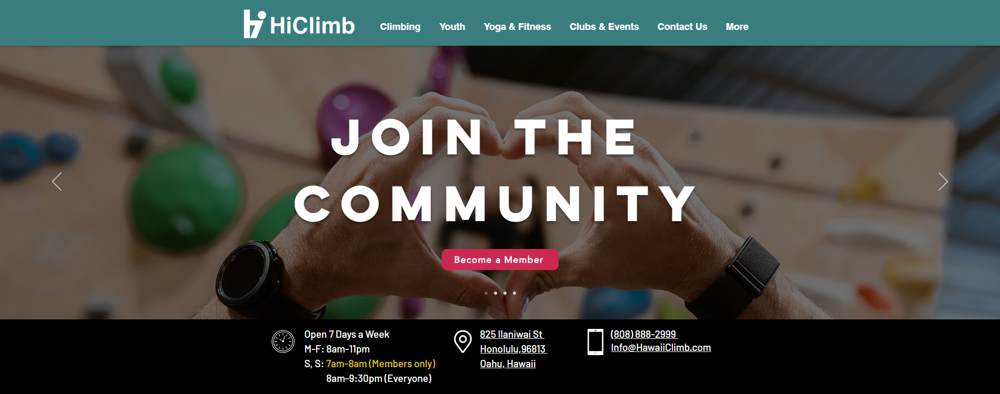
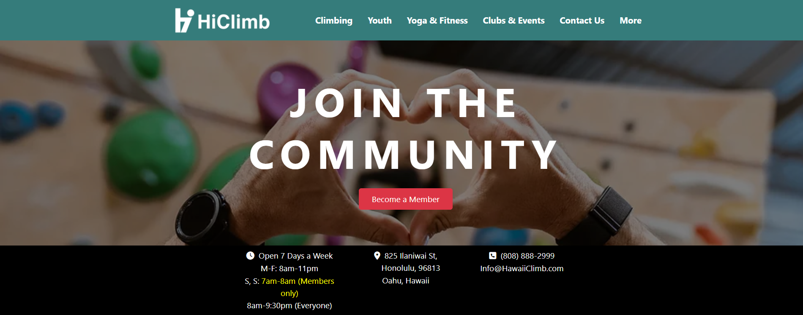

## What is a UI Framework?

A UI (User Interface) framework is a pre-built set of graphical user interface (GUI) elements, like buttons, checkboxes, dropdowns, etc., that developers can use to build the front end of web or mobile applications. Some of these frameworks, such as [Bootstrap 5](https://getbootstrap.com/docs/5.0/getting-started/introduction/), are considered by some to be overcomplicated – the preferred alternative being raw HTML and CSS.

Last week, I learned HTML and CSS on the fly over the course of a few days. This week, I learned to use Bootstrap 5 to add to my front-end development abilities. Learning to use a UI, like Bootstrap 5, can sometimes feel as difficult as learning a new programming language – especially relative to HTML. With that in mind, I'd feel comfortable saying that UI frameworks are an incredibly useful tool for enhancing software development.

## Technical Difficulties

Learning a UI framework requires an initial time investment. You need to be familiar with a lot of things that are unique to each UI framework, such as its components, grid system, utility classes, etc. For a beginner, I could easily see this being overwhelming, especially if it's your first time working with any front-end programming materials. The complexity that comes with UI frameworks is a byproduct of their flexibility and power.

Check this out! The below images are [top] a screenshot of [HiClimb](https://www.hawaiiclimb.com/)'s official website and [bottom] my attempt at recreating it using Bootstrap 5, along with HTML and CSS.

## So, Bootstrap 5?
There are a few key reasons to consider using Bootstrap 5 in tandem with HTML and CSS:
1. **Consistency and Compatibility**: Bootstrap provides a set of pre-built, standardized components that ensures consistency across browsers and devices. Bootstrap's compatibility features across browser versions allow a developer (like me (and you!)) to add buttons, forms, nav menus, and other elements without the concern of incorrect displays (across browsers and devices).
2. **Speed of Development**: Building a website from scratch with raw HTML and CSS is time-consuming. Doubly so if your goal is to achieve responsiveness and/or a modern design aesthetic. Bootstrap 5's pre-designed components can be integrated very quickly and easily. Bootstrap's grid system also follows a mobile-first design, which eliminates the need to build responsive layouts from scratch.
3. **Responsive Design**: Like I mentioned earlier, Bootstrap's grid system (one of its core features) offers a responsive, fluid grid that scales based on screen size. This is super helpful. This means that by default, layouts created with Bootstrap can be adapted to various devices (desktop, tablet, mobile). In today's web development landscape, tools like these should not be overlooked.
4. **Customizability**: Bootstrap 5 is *highly* customizable. At first glance, the built-in logos and formatting might seem rigid and limiting as far as the style of your website goes, but this is not the case. Developers can override default styles with CSS to achieve a unique look while still benefiting from Bootstrap's underlying structure.
5. **Active Development and Community Support**: Last but not least, Bootstrap 5 is an open-source project with a huge community. This means that you can find countless resources – documentation, tutorials, and forums – available to help troubleshoot and learn. The framework is also actively maintained, which means regular updates, bug fixes, and improvements.

##  Why Not Raw HTML and CSS?
Sure, HTML and CSS are the foundation of web development, but using them without a framework comes with a few challenges:
1. **Reinventing the Wheel**: Without a UI framework, every developer would basically have to create their own set of components, which often leads to inconsistencies and redundant work. Each button, form, or nav bar would need custom styling, which can affect design and behavior in ways that are hard to figure out, even with help. For larger projects, this quickly becomes unmanageable.
2. **Time-Consuming**: Manually crafting every detail of a web page takes significantly more time compared to using a framework like Bootstrap 5 – and believe me, I've tried. While this might be okay for small projects, the inefficiencies will pile up with larger applications.
3. **Responsiveness**: Without a grid system like Bootstrap's, creating a responsive layout requires extensive use of CSS media queries. This adds complexity and maintenance overhead, especially as the number of devices and screen sizes grows. Bootstrap's grid abstracts much of this away, allowing developers to focus on design rather than device-specific tweaks.

## Final Thoughts
UI frameworks like Bootstrap 5 offer a wide range of benefits that, I believe, justifies the learning curve. UI frameworks save time, promote consistency, ensure responsiveness, and come with built-in compatibility for a variety of browsers and devices, which is pretty cool. While raw HTML and CSS give you more control, they also come with the burden of reinventing common patterns, making UI frameworks a more efficient alternative for modern web development.

Whatever the case, when it comes to bridging the gap between the complexity of modern web design and the efficiency required for high-quality software development, UI frameworks are the way to go.
