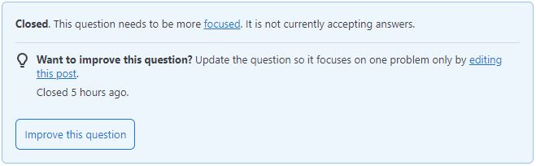

## What is a Smart Question?
‘Smart questions’ in software engineering refer to questions that aren’t stupid. It’s simple, elegant, and – there are a few more steps than that, actually. A smart question is one that is thought out, relevant, and aimed at gaining a better understanding of a problem. A question such as this is typically precise, focuses on a specific aspect of a broader issue, and is formulated after some preliminary research or thought. To ask a smart question, you first have to have a thorough understanding of the material you are working with and the context of the problem itself.

## What Does a Smart Question Look Like?
Okay, so… I know what a smart question is, but what does it look like? For that, I have an [example](https://stackoverflow.com/questions/72252967/react-cant-access-updated-value-of-state-variable-inside-function-passed-to-se) that I found on the Stack Overflow questions forum. The subject header reads as follows:

<hr>
<pre>   React, can’t access updated value of state variable inside function passed to setInterval() in useEffect() </pre>
<hr>

This user is starting their smart question strong with the first thing anybody with an answer is going to see – the header. Within this subject header, useful information is provided to help people better understand the situation they trying to help the user with, including:
1. This user is working with React.js, or React – a JavasScript library for building user interfaces.
2. The specific issue they are having – the updated value of a state variable within a function isn’t being accessed.
3. Where the user suspects the issue is occurring – in a function passed to the `setInterval()` method located within the `useEffect()` method.

The first paragraph provided by this user is a precise and informative description of the problem they are having:

<hr>
<pre>
   I am building a simple clock app with React. Currently the countDown() function works, but I would like the user to 
   be able to stop/start the clock by pressing a button. I have a state boolean called `paused` that is inverted when 
   the user clicks a button. The trouble is that after the value of `paused` is inverted, the reference to `paused` 
   inside the `countDown()` function passed to `setInterval()` seems to be accessing the default value of `paused`, 
   instead of the updated value.
</pre>
<hr>

First and foremost, the use of markdown here to emphasize methods and variables serves the purpose of both assisting those who want to assist you, and showing that you have at least a basic understanding of the *things* you’re talking about. This first paragraph breaks down exactly *what* the end goal of the code is – for a user to be able to stop/start the clock by pressing a button. It also describes the specific issue this question revolves around in detail, including the particular state variable, `paused`, and the issue he *knows* he is experiencing – the `countDown()` method is accessing the default value of `paused`, rather than the updated value.

After this brief (and quite helpful) description of the problem, the user provides a snippet of their `Clock()` function, a contained scope that narrows down the amount of code a decided helper will need to review and troubleshoot to help answer the question:
```js
function Clock(){
  const [sec, setSecs] = useState(sessionLength * 60);
  const [paused, setPaused] = useState(false);
 
  const playPause = () => {
    setPaused(paused => !paused);
  };
  
  const countDown = () => {
    if(!paused){
        setSecs(sec => sec - 1)
      }
  }
  
  useEffect(() => {
    const interval = setInterval(() => {
        countDown();
    }, 1000);
    return () => {
      clearInterval(interval);
    };
  }, []);
```
The user then emphasizes in a follow-up paragraph that they believe the issue is being caused by the asynchronous nature of calls to the `setState()` method in React, and/or the nature of scoping/context when using regular expressions. This user also mentions that they have *NOT* been able to determine the root of the issue by reading documentation related to the aforementioned concepts. This is important. Failing to mention something as critical as your own research into the question you’re asking could get you flagged with an ‘RTFM’ or ‘STFW’ tag. In short (and safe for work terms), these tags mean “read the manual” or “search the web” respectively.

Finally, the user closes with the notion that they have some workarounds in mind that would allow their app to function as desired, but they *want* to understand what is wrong with their current approach. To wrap up this smart question, the user gives thanks in advance to anyone who can shed light on their situation.

## Receiving Smart Answers
This question was asked over two years ago and has over 2,000 views at the time of writing. Due to the comprehensive nature of this smart question, several people have been able to offer help where possible to assist this user with their problem. One person was able to provide a fully fleshed-out answer with examples of working code based on the user’s query. If that wasn’t enough, the user also had follow-up questions for the answerer to further their understanding for future use – a textbook example of how asking a smart question can help both parties understand and solve a problem.

## There’s No Such Thing as a Dumb Question… Or Is There?
There is a list of things you can do to ask a ‘bad’ smart question. More than anything, though, a bad smart question represents the absence of the traits of a good smart question. To demonstrate a [bad smart question](https://stackoverflow.com/questions/78980257/python-guessing-game-for-list-of-colors-from-user), I found a Stack Overflow question that begins with the following header:

<hr>
<pre>
   Python Guessing Game for List of Colors from User [closed]
</pre>
<hr>

There is one big issue with this header–it’s not a question. It doesn’t even fall within the realm of presenting the description of an issue. Instead, it appears to be the project description for a homework assignment. Upon opening the question, my suspicions were confirmed via some text enclosed in a blue box, which can be seen below.



As you can see from the header, and now this notification, the question was closed because it needs to be more focused. In other words, this person doesn’t have a specific question, they want someone else to code the solution to their assignment that the user provided the instructions for in the body of their query. In case you’re curious, the instructions are for a code that involves writing an application in python that prompts the user to guess a color based on predetermined colors chosen at random by the computer.
This question was asked on the day of this essay's conception. It currently has 33 views. This user’s ~~dumb~~ bad smart question provides no indication of a basic understanding of the material they are working with, any specificity regarding a problem, or any attempts to ask for help understanding the code rather than an answer. 
However, this question did have one comment that asked some questions of their own:

<hr>
<pre>
   If we do your assignment will we get the academic credit? You can’t just dump your homework here and expect someone 
   to do it for you. What will you learn from that?
</pre>
<hr>

## Wrapping It Up
As it turns out, asking smart questions to receive smart answers is *incredibly* important – especially in a software engineering environment. In a world where open source software exists, collaborations on projects are staples, and errors run rampant, it is crucial that you competently express your ideas (and questions) so that you can get help. Seeing the stark differences in responses invoked by each question should be enough to convince you that in a field where everyone else is smart, you should be too. It takes two forces to create friction, and following suit, it takes two (or perhaps a few) smart people to solve a problem.

If you would like to learn more, here is a guideline on [How To Ask Questions The Smart Way](http://www.catb.org/esr/faqs/smart-questions.html).
